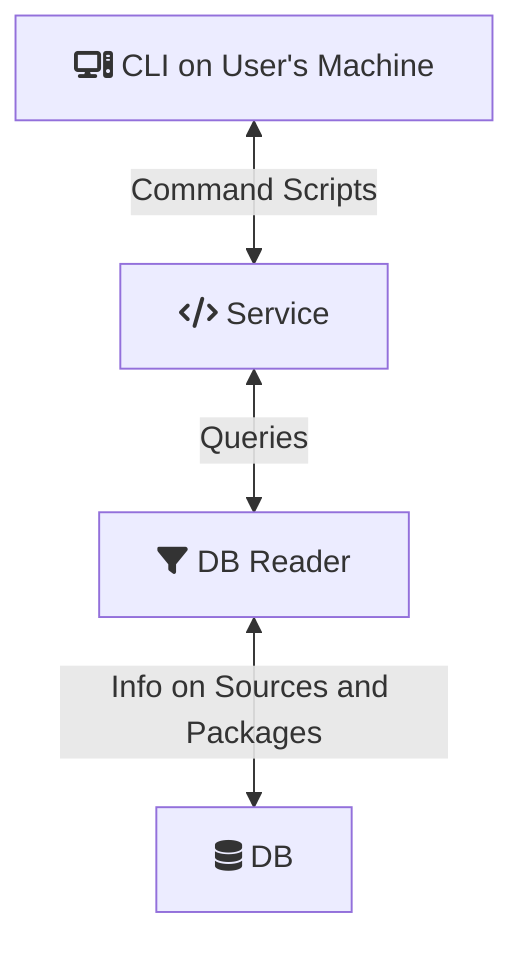

# Crater

*Crater* is a super-lightweight, universal, "meta" package manager for UNIX-like platforms. Three out of four elements of *crater* run away from the end-user's machine and the only one the user interacts with has been designed to run with no external dependencies. This makes *crater* fairly cross-platform and works magically with the help of its remotely hosted modules to provide a functional yet easy-to-use interface.

